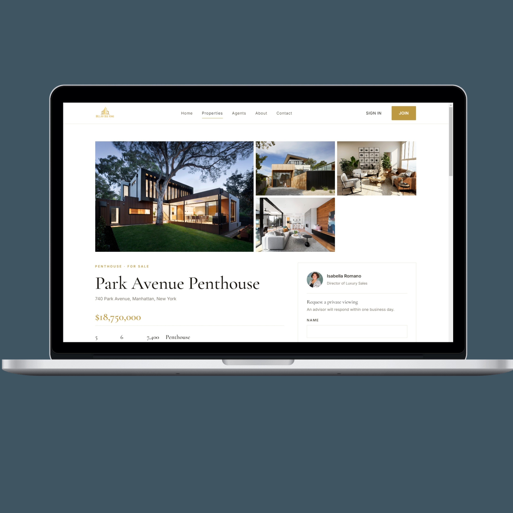
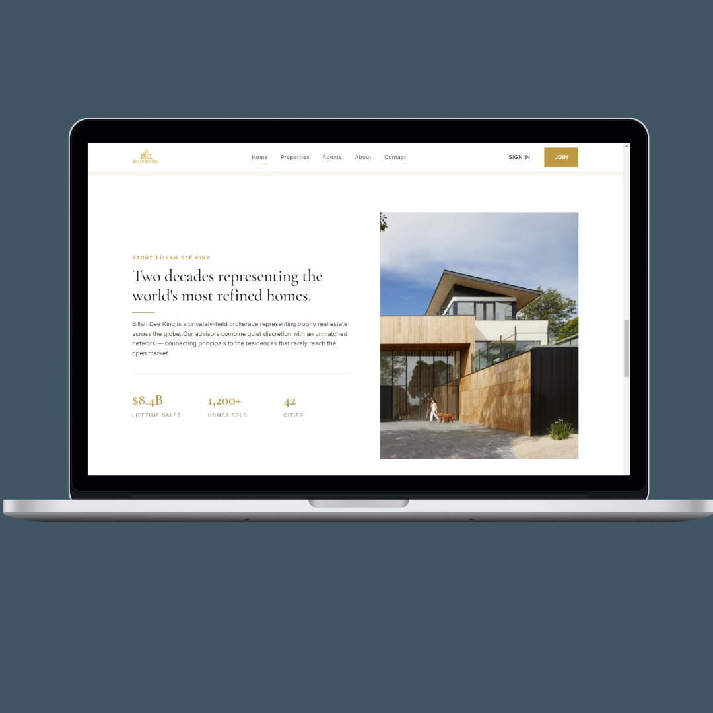
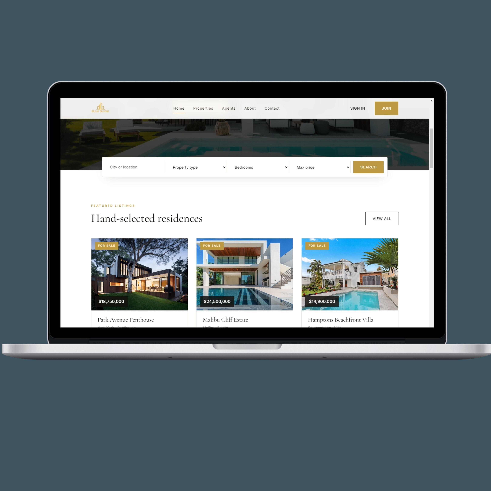

# Billah Dee King — Premium Real Estate Platform

## Screenshots






A complete, production-style real estate website built with **HTML, CSS, vanilla JS, PHP, and MySQL**. Premium white + gold (#bd9941) aesthetic.

## Features
- Public site: home, listings (filters + pagination), property details, agents, about, contact
- Authentication: register → email verification code → login (bcrypt), forgot password reset
- User dashboard: favorites, inquiries, profile
- Admin dashboard: CRUD properties, agents, users, inquiries, image uploads
- PHPMailer SMTP for verification, password reset, and contact form
- Strict **relative paths** everywhere — no BASE_URL, no `__DIR__` magic
- Seeded with 12 luxury listings, 6 agents, demo users

## Requirements
- PHP 8.0+
- MySQL 5.7+ / MariaDB 10+
- Composer (for PHPMailer) — or drop PHPMailer into `includes/PHPMailer/`
- Apache / Nginx / `php -S` for local dev

## Setup

1. **Copy files** into your web root (e.g. `htdocs/billah-dee-king/`).

2. **Create the database**:
   ```sql
   CREATE DATABASE luxe_estates CHARACTER SET utf8mb4 COLLATE utf8mb4_unicode_ci;
   ```
   Import the schema + seed data:
   ```bash
   mysql -u root -p luxe_estates < database/schema.sql
   ```

3. **Environment** — copy and edit:
   ```bash
   cp .env.example .env
   ```
   Fill in `DB_*` and `EMAIL_*`. For Gmail use an [App Password](https://myaccount.google.com/apppasswords).

4. **Install PHPMailer**:
   ```bash
   composer require phpmailer/phpmailer
   ```
   Or download manually and place under `includes/PHPMailer/src/`.

5. **Permissions** — make the uploads dir writable:
   ```bash
   chmod -R 775 uploads
   ```

6. **Run**:
   ```bash
   php -S localhost:8000
   ```
   Open `http://localhost:8000/`.

## Demo accounts
- Admin — `admin@billahdeeking.com` / `Admin@123`
- User  — `john@example.com` / `User@123`

## Project layout
```
index.php, properties.php, property-details.php, about.php, agents.php, contact.php
login.php, register.php, verify-email.php, forgot-password.php
dashboard.php, logout.php
admin/
includes/   (db.php, config.php, header.php, footer.php, auth.php, mailer.php, functions.php)
assets/css/style.css
assets/js/main.js
assets/images/
uploads/properties, uploads/agents
database/schema.sql
.env.example
```

All asset references use **relative paths** (`assets/...`, `includes/...`) so the site works from any subdirectory.
